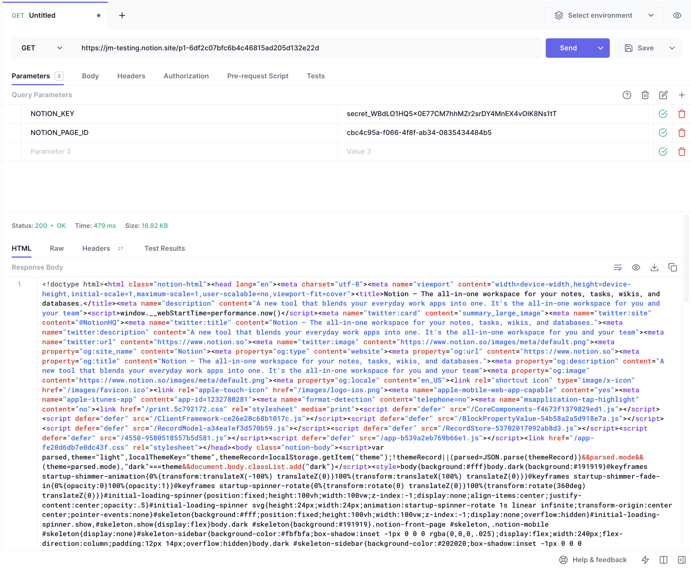

# CSC207CourseProject
Members: Vivian Deng, Jaehyeong Jang, Min Tun Myo, Emily Shen

## Problem Domain
As university students, studying plays a large part in our daily lives and remains a crucial component of our academic career. Although there is a wide variety of studying available apps, we want to create a study tailored to university students, and if able, specifically for University of Toronto students.

A large part of our learning stems from attending lectures and self-revision of these materials. We believe that note-taking and self-assessment are the major tools used by current students to increase their understanding of course materials. These tasks seem trivial but are rather crucial for our learning in many areas, and the experience can be enhanced with an application.

The primary learning platform at the University of Toronto is Quercus (also known as Canvas), where course materials can be accessed via a web browser or mobile application. This makes Quercus an important part of our learning career. However, this system is relatively isolated and not integrated with other learning tools we may have. We often create our own calendar of assignment deadlines and important dates (in Google, Outlook, etc.) that is time inefficient and error-prone. We plan on integrating this into our application, so students can easily access course materials from our studying application, which can increase their efficiency.

## Description
This study program will be a combination of multiple different productivity tools we have right now. 

Features we plan on implementing:
- **Note taking:** users can write notes on our program and save them to Notion. 
- **Assignment Tracker:** students can import their assignment dates and keep track of each assignment's deadline using a calendar. In the calendar, users could potentially add other important events. 
- **Quiz Generator:** using the notes the user writes, the program can generate a quiz for them to take. This quiz will be reworded and have different types of questions (e.g. short response, multiple choice, fill in the blank, etc). Once the user is done, the quiz will be automatically graded and provide answers to them. The answers may also point to certain parts of the user's notes to show them what to review 
- **Flashcard Generator:** users can create their own flashcards for them to study off of. 

Features we are considering of implementing:
- **To-do list:** users can create their own tasks and mark them off to keep track of their priorities and progress.
- **Time Management:** users can use the Pomodoro technique to study. They can customize the length of the study and break periods.
- **Study with Friends:** users can friend others and keep each other in check. People can look at their friend's stats and they can compete to see how productive they are throughout the week.

## API Documentation
- Link to the Notion API Document (Notion Page Object):
  https://developers.notion.com/reference/page
  - This API could be used as a part of our main UI since note-taking is one of the main feature of our service.
  - Furthermore, using this API, any note typed on our interface will be automatically synced with Notion in real-time.
  - This API is the one demonstrated in the Java file provided.

- Link to the Quercus (Canvas) API:
  https://canvas.instructure.com/doc/api/
  - This API could be used to retrieve individual assignments and corresponding deadlines to be displayed on out main UI. 

- Link to the repository for Pomodoro Time Management API https://github.com/jordanch/pomodoro
  - This API could be an extra feature to provide Pomodoro Time management.
  - This is a potential side feature to me implemented.

## API Call

## Example Output
{"parent":{"page_id":"cbc4c95a-f066-4f8f-ab34-0835434484b5"},"properties":{"title":[{"text":{"content":"created with API on Java"}}]}}
Response{protocol=h2, code=200, message=, url=https://api.notion.com/v1/pages}

## Technical Problem
1. Retrieving personal information such as individual assignments, due dates, and notifications on Quercus (Canvas).
The way of authentication is strictly limited when using Quercus API, Moreover, since all the UofT-related web 
services utilize an external application called "Duo" as a mean of authentication, related API calls incorporating 
the Duo service has to be explored as well.

2. Limited capacity of free open APIs: Though all the APIs we have so far identified to use do provide full features with its paid version,
free version has quite limited capacities such as limited lenght of document when using Notion API and limited file size 
for a text file to be converted into a PDF through an API called "pspdfkit.

3. Construction of UI with Java GUI: for this assignment, since use of another language and external tools are restricted, 
the overall aesthetics and functionalities are limited.
